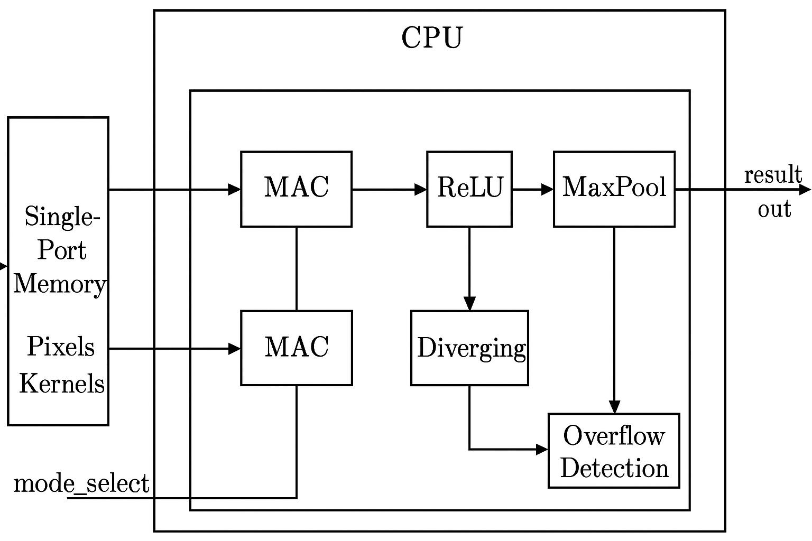

# 🧠 Parameterized CNN Compute Unit with Overflow Detection (Verilog)

A **hardware implementation of a mini Convolutional Neural Network (CNN) compute unit** in **Verilog**, designed for FPGA and hardware accelerator use.  
This project was developed as part of the **Yukti 2025 Hardware Design Competition**.

---

## 📜 Problem Statement

Design a **CNN Compute Module** capable of performing:
- **MAC (Multiply–Accumulate)**
- **ReLU (Rectified Linear Unit)**
- **MaxPooling**

### Requirements:
- 8-bit signed input data
- 2-bit mode selector
- 32-bit output
- FSM-based control
- Internal memory to cache pixel and kernel data

### Bonus Objectives:
- ✅ Overflow detection and saturation
- ✅ Parameterized window size (3×3, 5×5, etc.)
- ⬜ Parallel multi-dot product computation (future extension)

---

## 🧩 Features

| Feature | Description |
|----------|--------------|
| **Parameterized Design** | Adjustable window size (`parameter WINDOW = 3/5/7...`) |
| **Overflow Detection** | Detects signed arithmetic overflow and saturates output |
| **Three Modes** | MAC, ReLU, MaxPool |
| **Single-Port Memory** | Unified storage for pixels and kernels |
| **FSM Controller** | Handles data loading and operation sequencing |
| **Waveform Verification** | Tested using Icarus Verilog and GTKWave |

---

## 🏗️ System Architecture

Below is the architectural block diagram of the CNN Compute Unit:

### Components:
- **Memory Block** – Stores pixel and kernel data  
- **FSM Controller** – Manages IDLE, LOAD, and RUN states  
- **MAC Unit** – Performs multiply-accumulate operations  
- **ReLU Unit** – Applies `max(0, x)` activation  
- **MaxPool Unit** – Computes the maximum pixel value  
- **Overflow Logic** – Detects signed overflow and clamps output  

---

## ⚙️ Simulation Setup

| Parameter | Value |
|------------|--------|
| Input Width | 8-bit signed |
| Output Width | 32-bit signed |
| Simulation Tool | Icarus Verilog (iverilog) |
| Waveform Viewer | GTKWave |
| Clock Period | 10 ns |
| Modes | 00 – MAC, 01 – ReLU, 10 – MaxPool |

---

## 🧪 Testbench and Results

### ✅ Output Console Log

### 🖥️ Output Screenshot

---

## 📊 GTKWave Simulation

Waveform verification showing clock, FSM transitions, result output, and overflow flag activity.

